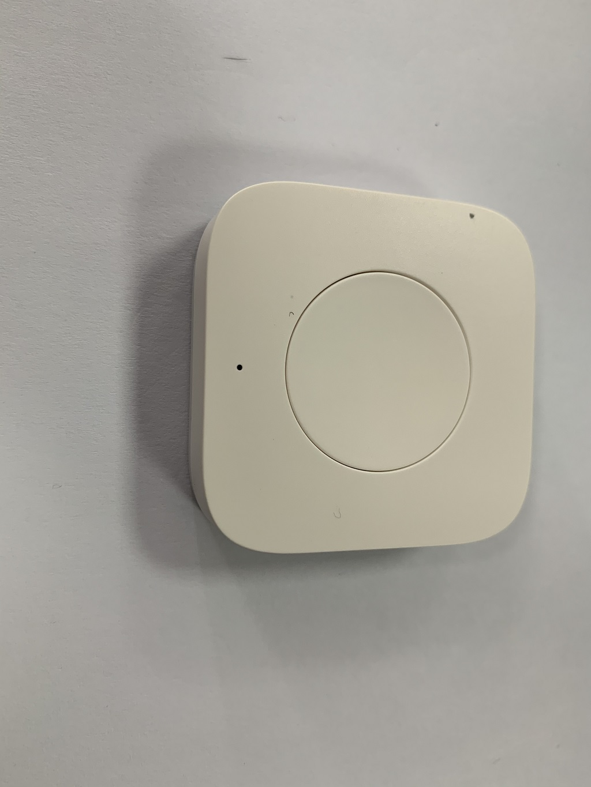

# NXP JN5169 zigbee 3.0 协议栈source code for 小米39元无线开关(同时支持绿米无线开关升级版)
- 欢迎各种JS前来抄袭

#### 备注
- 针对小米39元无线开关，在NXP JN5169平台的代码实现，在按键按下之后能够实现组播的方式向外发送信号，而不是官方自带的固件，只能实现向网关(短地址0x0000)发送report attribute单播指令，这样就必须依赖网关才能实现对其他设备的控制,组播的方式可以脱离网关
- 基于DimmerSwitch示例工程开发
- 工作在end device模式，入网后休眠功耗1.3uA，工作功耗比较高，入网功耗大概十几毫安，组播发送指令2毫安左右，深度休眠电流0.2uA
- 入网之后默认唤醒周期为60minutes，符合child aging特性，经过两年实测，功耗的确很低，一颗CR2032电池可以续航一年左右
- LED连接的是DIO11引脚，拉高灭，拉低亮
- 板子中间功能键连接的是DIO16 DIO17引脚，下降沿触发，这里不清楚为什么同一个按键，通过两个1K电阻分别连接到DIO16和DIO17上，按理说一个足够了
- 配网按钮连接的是DIO0，下降沿触发
- 可以通过指令配置组播的地址，并写入PDM保存，重新上电自动读取组播地址
- 入网阶段所有信道尝试steering入网，如果失败，直接进入深度休眠
- 通过BASIC cluster可以配置组播地址
- 长按网络配置按钮超过5s，LED开始闪烁5次，自动退网并重新steering入网，入网成功之后，LED长闪烁3次
- 协调器断电，导致rejoin失败，则进入深度休眠
- endpoint参数配置，[app.zpscfg编辑方法参考](https://blog.csdn.net/code_style/article/details/90487512)
- 已支持私有协议，代码在sdk\JN-SW-4170\Components\ZCL\Clusters\Private，可以选择使用私有协议report attribute和网关实现联动控制

#### 硬件线序图
- 
- 所谓绿米开关升级版，和小米39元无线开关用的同一款芯片，连按键，LED指示灯线序都一模一样，只是外壳不一样


#### 分支
- master 无线开关(小米39元无线开关白色圆形，绿米无线开关升级版)
- lvmi_wxkg 绿米无线开关(86面板贴墙式，包含1键，2键，3键)

#### 已知问题
- 无

#### 如何编译
- import project to BeyondStudio 


- select Active "DimmerSwitch,JN5169,DR1199" configuration in properties of project


#### 烧写方法
- 先进入ISP模式(ISP引脚接地，同时RESET复位即可进入)
```
JN51xxProgrammer.exe -s COM7 -P115200 --eraseflash=full -f C:\NXP\bstudio_nxp\Application\JN-AN-1219-Zigbee-3-0-Controller-and-Switch\DimmerSwitch\Build\DimmerSwitch_JN5169_DR1199.bin
```


- 绿米无线开关升级版 



- 绿米无线开关升级版


- 绿米无线开关升级版

